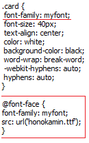

# Japanska resurser

## Anki-lekar 

### Japanska ord 

En lek som innehåller:

1. En lek för dina egna ord
2. En lek som innehåller alla ord från texter som gås igenom under basåret
3. En lek med dem vanligaster 6000 japanska orden med trevliga bilder, ljud och meningar

Lekarna är förinställda med rekommenderat antal ord per dag och rekommenderade inställningar. 

**Länk:** Laddas ned [här](https://eastasian.studorg.liu.se/wp-content/uploads/2021/08/tango.apkg)

### Kanji

En lek som innehåller:

1. En lek med alla kanjis som kommer på duggorna under basåret i ordning 
2. En lek med alla kanjis du kommer behöva i ordning av ökande obskyritet

Lekarna är förinställda med rekommenderat antal kanji per dag och rekommenderade inställningar. 

**Länk:** Laddas ned [här](https://eastasian.studorg.liu.se/wp-content/uploads/2021/08/kanji.apkg) 

### Kanjiduggor TEII44 (första japanska-kursen Yi/Ii)

En lek med kanjis som kommer på duggor. All cred för leken till Stephanie Arenander!

**Länk:** Laddas ned [här](https://eastasian.studorg.liu.se/wp-content/uploads/2020/09/Duggor%20TEII43.apkg)

### Tekniskt vokabulär

En samling ord med anknytning till programmering och civilingenjörsskap samt mer eller mindre relevanta bilder och ibland ljud.

**Länk:** Laddas ner [här](https://eastasian.studorg.liu.se/wp-content/uploads/2020/09/Tech.apkg)

### Japanska prefekturer

En lek som går igenom japansk geografi.

Notera att det är en stor flex att visa att man vet var prefekturen ligger när man frågar en japan var dem kommer ifrån.

**Länk:** Kan hittas [här](https://ankiweb.net/shared/info/2639768625) 

## Fonts

Kopiera font-filen in i ankis "collection.media"-mapp och lägg till markerade rader till kortets Styling för att använda. Byt ut "honokamin.ttf" mot namnet på filen du använder.

### Honokamin

吾輩は猫である

Ett typiskt snyggt typsnitt, ser ut som texten ovan. 

**Länk:** Kan laddas ner [här](https://mega.nz/file/PNwXlApJ#1bYbBQoq3hoX-PQ1JIQZXLpyD-QLhqmnlPCdPCRrg6Q)

## Appar

### Akebi (android)

Ett uppslagsverk för japanska ord baserat på JMDICT.

Rekommenderas **starkt** med tanke på den extremt smidiga AnkiDroid-integrationen. Tyvärr ej tillgänglig på iOS vid skrivande stund.

**Länk:** Kan hittas [här](https://play.google.com/store/apps/details?id=com.craxic.akebifree&hl=en_US)

### Kana school (iOS)

En app...

### Kana Tree (andriod)

En app...

### Easy Japanese news (iOS/android)

En lättförståelig nyhetsapp på japanska.

Bli inte avskräckt om texterna verkar svåra trots namnet, dem är bara lätta *jämfört* med vanliga nyheter, som är *betydligt* svårare.

**Länk:** Kan hittas [här](https://play.google.com/store/apps/details?id=com.aovill.language.e2l.ejn&hl=en_US) (android) och [här](https://apps.apple.com/us/app/easy-japanese-news-%E7%B0%A1%E5%8D%98%E3%81%AA%E6%97%A5%E6%9C%AC%E3%81%AE%E3%83%8B%E3%83%A5%E3%83%BC%E3%82%B9/id1107177166) (iOS)

## Gramatik

### Tae Kim

En sida som går igenom japansk grammatik från grunden.

Sidan är bra som referens och för repetera koncept man är osäker på.

**Länk**: [guidetojapanese.org](http://www.guidetojapanese.org/learn/)

### Imabi

Ytterligare en sida för grammatik som täcker mer än Tae Kim.

**Länk**: [imabi.net](https://www.imabi.net/tableofcontents.htm)

## Media

### Rawdevart (japansk/kinesisk/koreansk manga)

Sida som innehåller tecknade serier från fjärran öst.

**OBS:** Innehåller även manga som är 18+.

**Länk**: [rawdevart.com](https://rawdevart.com/)

### Animelon 

Streaming-sida med anime som har japanska undertexter.

**Länk**: [animelon.com](https://animelon.com)

## Custom Anki-addons

*Anki-bulker* låter dig lägga till audio, ljud och definitioner till dina kort. Kodad av Axel.

Gå in på Tools -> Add-ons -> "Install from file" och välj "anki_bulker.ankiaddon". För att lägga in media gå in i Browser, markera korten i fråga och klicka på "Edit" --> "Bulk-add xxx".

Säg till om det inte fungerar!

**Länk:** [Här](https://eastasian.studorg.liu.se/wp-content/uploads/2020/09/anki_bulker.ankiaddon)

## Övriga sidor

* Jisho
* kotobank
* osv
